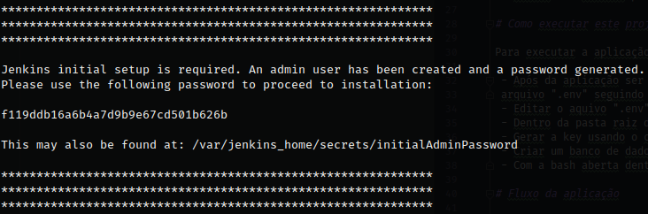

# Criando projeto com o [Jenkins](https://jenkins.io/)

Dentro do container executar comando abaixo para criar o projeto e um container docker com Jenkins (Não alterar noma da pasta final 'jenkins_home' e a porta para executar o serviço '8080'):

```
docker run --name dati-jenkins -p 8080:8080 -p 50000:50000 -v /home/dati/Documents/Projects/jenkins_home/:/var/jenkins_home/ jenkins/jenkins:lts
```

Após ser executado esse comando será mostrado um código. Esse código será utilizado posteriormente para configurar nosso ambiente no primeiro acesso



Acessando o a url da maquina na porta 8080 será exibido essa tela:


Cole o código copiado em Administrator password e clique em continuar, depois escolha a opção Install suggested plugins e seu projeto Jenkins começará a ser construido.


Após a instalação crie o primeiro usuário admin salve, continue e seu projeto Jenkins já estará pronto para o uso.
 
## License
 
The Laravel framework is open-sourced software licensed under the [MIT license](https://opensource.org/licenses/MIT).

